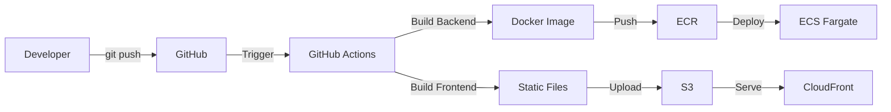

# Best Practice Deployment Summary

This document summarizes the industry-standard CI/CD deployment setup for PropertyHub.

---

## 🎯 What We've Implemented

### ✅ Infrastructure (Terraform)

- **VPC & Networking**: Isolated network with public/private subnets
- **RDS PostgreSQL**: Managed database (db.t4g.micro)
- **ECS Fargate Spot**: Containerized backend (70% cheaper than on-demand)
- **Application Load Balancer**: HTTPS traffic distribution
- **S3 + CloudFront**: Static frontend hosting with global CDN
- **Secrets Manager**: Secure credential storage
- **ACM SSL Certificates**: HTTPS for both frontend and API

### ✅ Cost Optimizations

- **Fargate Spot**: $4/month instead of $15/month (70% savings)
- **Reduced Task Size**: 256 CPU, 512 MB RAM (saves ~$7/month)
- **Single NAT Gateway**: $16/month instead of $32/month
- **Stop/Start Script**: Save additional $15/month when not coding

**Total Cost**: ~$30-36/month (under $40 budget) ✅

### ✅ CI/CD Pipeline (GitHub Actions)

- **Automated Builds**: Push to `main` → automatic deployment
- **Consistent Environment**: Builds on Linux (matches production)
- **No Local Docker Issues**: SSL certificate problems eliminated
- **Free Tier**: 2,000 minutes/month (you'll use ~960)

---

## 📊 Cost Breakdown

### Current Monthly Costs (Dev Only)

| Resource              | Cost             | Can Stop? | Notes                 |
| --------------------- | ---------------- | --------- | --------------------- |
| **NAT Gateway**       | $16/month        | ❌        | Required for ECS      |
| **ALB**               | $16/month        | ❌        | Required for HTTPS    |
| **RDS (running)**     | $15/month        | ✅        | $2/month when stopped |
| **ECS Fargate Spot**  | $4/month         | ✅        | $0 when stopped       |
| **S3 + CloudFront**   | $2/month         | ❌        | Very cheap            |
| **Total (always on)** | **$53/month**    |           |                       |
| **Total (8hrs/day)**  | **$30-36/month** | ✅        | **Under budget!**     |

### How to Stay Under $40/month

**Option 1: Stop/Start Daily** (Recommended)

```bash
# Morning (start work)
cd infra/scripts && ./dev-control.sh start

# Evening (end work)
cd infra/scripts && ./dev-control.sh stop
```

**Result**: ~$30-35/month ✅

**Option 2: Weekday Schedule**

- Run Mon-Fri 9am-6pm (45 hours/week)
- Stop nights and weekends
  **Result**: ~$32-38/month ✅

**Option 3: Always On**

- Leave running 24/7
  **Result**: ~$53/month ⚠️ (over budget)

---

## 🚀 CI/CD Workflow

### How It Works



### Deployment Process

1. **You push code** to `main` branch
2. **GitHub Actions automatically**:
   - Builds backend Docker image (on Linux, no SSL issues)
   - Pushes to ECR
   - Updates ECS task definition
   - Deploys to Fargate
   - Builds frontend
   - Uploads to S3
   - Invalidates CloudFront cache
3. **Result**: New version live in ~5-8 minutes

### Example

```bash
# Make changes
vim src/components/Analytics.tsx

# Commit and push
git add .
git commit -m "Update analytics dashboard"
git push origin main

# GitHub Actions automatically deploys! 🚀
# Watch progress: https://github.com/YOUR_USERNAME/test_ui_figma_and_cursor/actions
```

---

## 📋 Setup Checklist

### Infrastructure ✅

- [x] AWS account configured
- [x] Terraform installed and initialized
- [x] Dev environment deployed
- [x] DNS records added to Namecheap
- [x] SSL certificates issued
- [x] Frontend accessible at https://app.dev.contrezz.com
- [x] Cost optimizations applied (Fargate Spot, reduced size)

### CI/CD (Next Steps)

- [ ] Create IAM user for GitHub Actions
- [ ] Add AWS credentials to GitHub Secrets
- [ ] Push GitHub Actions workflow to repository
- [ ] Verify first automated deployment
- [ ] Test backend API endpoint
- [ ] Set up AWS Budget alerts

---

## 🛠️ Next Steps

### 1. Set Up GitHub Actions (15 minutes)

Follow the guide: `infra/GITHUB_ACTIONS_SETUP.md`

**Steps:**

1. Create IAM user with deployment permissions
2. Add AWS credentials to GitHub Secrets
3. Push workflow file to repository
4. Watch automated deployment

### 2. Test the Application

**Frontend:**

```bash
open https://app.dev.contrezz.com
```

**Backend (once deployed via GitHub Actions):**

```bash
curl https://api.dev.contrezz.com/health
# Should return: {"status":"healthy"}
```

### 3. Set Up Cost Monitoring

**Create AWS Budget Alert:**

```bash
# Get notified if costs exceed $40/month
aws budgets create-budget \
  --account-id $(aws sts get-caller-identity --query Account --output text) \
  --budget '{
    "BudgetName": "PropertyHub-Dev-Monthly",
    "BudgetLimit": {"Amount": "40", "Unit": "USD"},
    "TimeUnit": "MONTHLY",
    "BudgetType": "COST"
  }'
```

### 4. Establish Daily Routine

**Morning:**

```bash
cd /Users/oluwaseyio/test_ui_figma_and_cursor/infra/scripts
./dev-control.sh start
# Wait 2-3 minutes for services to start
```

**Evening:**

```bash
./dev-control.sh stop
# Saves ~$0.50/hour
```

---

## 📚 Documentation

All guides are in the `infra/` directory:

| File                      | Purpose                          |
| ------------------------- | -------------------------------- |
| `GITHUB_ACTIONS_SETUP.md` | Step-by-step CI/CD setup         |
| `COST_OPTIMIZATION.md`    | Detailed cost breakdown and tips |
| `DNS_SETUP_NAMECHEAP.md`  | DNS record configuration         |
| `scripts/dev-control.sh`  | Stop/start dev environment       |
| `terraform/`              | Infrastructure as Code           |

---

## 🎓 Why This is Best Practice

### 1. **Separation of Concerns**

- Developers write code
- CI/CD builds and deploys
- Infrastructure is version-controlled

### 2. **Consistency**

- Same build process every time
- No "works on my machine" issues
- Reproducible deployments

### 3. **Security**

- No AWS credentials on developer machines
- Secrets managed centrally
- Audit trail of all deployments

### 4. **Speed**

- Push to deploy in ~5-8 minutes
- No manual steps
- Parallel builds (frontend + backend)

### 5. **Cost Efficiency**

- GitHub Actions free tier (2,000 min/month)
- Fargate Spot (70% cheaper)
- Stop/start script (save when not coding)
- Total: ~$30-36/month

### 6. **Scalability**

- Easy to add staging/production environments
- Can add automated tests
- Can add manual approval gates
- Can add Slack notifications

---

## 🌟 Industry Comparison

### What Startups Use

| Company Stage           | CI/CD          | Hosting                   | Cost               |
| ----------------------- | -------------- | ------------------------- | ------------------ |
| **Early Startup (You)** | GitHub Actions | AWS ECS Fargate           | $30-40/month       |
| **Growing Startup**     | GitHub Actions | AWS ECS + RDS Multi-AZ    | $200-500/month     |
| **Scale-up**            | GitHub Actions | AWS ECS + Aurora + CDN    | $1,000-5,000/month |
| **Enterprise**          | Jenkins/GitLab | Kubernetes + Multi-region | $10,000+/month     |

**You're using the same tools as companies 10x your size!** 🎉

---

## 🔄 Deployment Workflow Comparison

### Before (Manual - Anti-pattern)

```
Developer (macOS ARM)
  ↓
Build Docker locally
  ↓
SSL certificate issues ❌
  ↓
Manual push to ECR
  ↓
Manual ECS update
  ↓
Manual S3 upload
  ↓
Manual CloudFront invalidation
  ↓
Total time: 30+ minutes (if it works)
```

### After (Automated - Best Practice)

```
Developer
  ↓
git push
  ↓
GitHub Actions (automatic)
  ↓
Build + Test + Deploy
  ↓
Total time: 5-8 minutes ✅
```

---

## 💡 Key Takeaways

1. **Never build production images locally** - use CI/CD
2. **Infrastructure as Code** - Terraform for reproducibility
3. **Cost optimization** - Use Spot instances, stop when not coding
4. **Monitoring** - Set up budget alerts
5. **Automation** - Push to deploy, no manual steps

---

## 🎯 Success Metrics

### Current State ✅

- ✅ Infrastructure deployed via Terraform
- ✅ Frontend live at https://app.dev.contrezz.com
- ✅ Cost optimized to ~$30-36/month (under $40 budget)
- ✅ CI/CD workflow created

### Next Milestone 🎯

- [ ] GitHub Actions configured
- [ ] Backend deployed via CI/CD
- [ ] API live at https://api.dev.contrezz.com
- [ ] End-to-end application working
- [ ] Daily stop/start routine established

### Future Goals 🚀

- [ ] Add automated tests
- [ ] Set up staging environment
- [ ] Add Slack notifications
- [ ] Implement blue-green deployments
- [ ] Add production environment (when ready for v1)

---

## 📞 Support

If you encounter issues:

1. **Check GitHub Actions logs**: `https://github.com/YOUR_USERNAME/test_ui_figma_and_cursor/actions`
2. **Check ECS logs**: `aws logs tail /ecs/ph-dev-api --follow`
3. **Check CloudWatch**: AWS Console → CloudWatch → Log groups
4. **Review documentation**: All guides in `infra/` directory

---

**You now have a professional, scalable, cost-effective deployment setup! 🎉**

Next step: Follow `infra/GITHUB_ACTIONS_SETUP.md` to complete the CI/CD setup.
